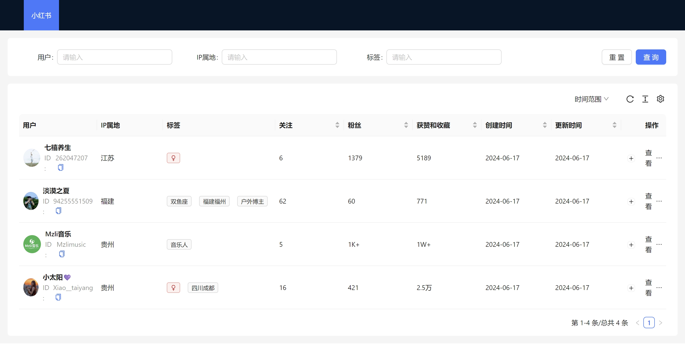

浏览器插件，自动归档管理自媒体平台的达人数据。适合小红书、知乎等平台，方便达人/大V关系运维。




### 功能列表:

- [x] 小红书，访问用户首页，自动归档用户信息（用户民、id、互动数据）到本地数据库
- [x] 小红书，用户数据检索（TODO：标签检索、用户添加&删除）
- [ ] 小红书，访问用户首页，自动归档笔记信息到本地数据库
- [ ] xxx

### `Tips：`
1. 项目常规功能完全免费开源，遵循 APL2。
1. 不接收 issue 和 pr，如有咨询或定制需求，可以先扫码支付，然后邮件 [xkuloud@gmail.com](mailto:xkuloud@gmail.com) 说明来意，附上打赏截图（非诚勿扰）


## Getting Started

First, run the development server:

```bash
pnpm dev
# or
npm run dev
```

Open your browser and load the appropriate development build. For example, if you are developing for the chrome browser, using manifest v3, use: `build/chrome-mv3-dev`.

You can start editing the popup by modifying `popup.tsx`. It should auto-update as you make changes. To add an options page, simply add a `options.tsx` file to the root of the project, with a react component default exported. Likewise to add a content page, add a `content.ts` file to the root of the project, importing some module and do some logic, then reload the extension on your browser.

For further guidance, [visit our Documentation](https://docs.plasmo.com/)

## Making production build

Run the following:

```bash
pnpm build
# or
npm run build
```

This should create a production bundle for your extension, ready to be zipped and published to the stores.

## Submit to the webstores

The easiest way to deploy your Plasmo extension is to use the built-in [bpp](https://bpp.browser.market) GitHub action. Prior to using this action however, make sure to build your extension and upload the first version to the store to establish the basic credentials. Then, simply follow [this setup instruction](https://docs.plasmo.com/framework/workflows/submit) and you should be on your way for automated submission!
